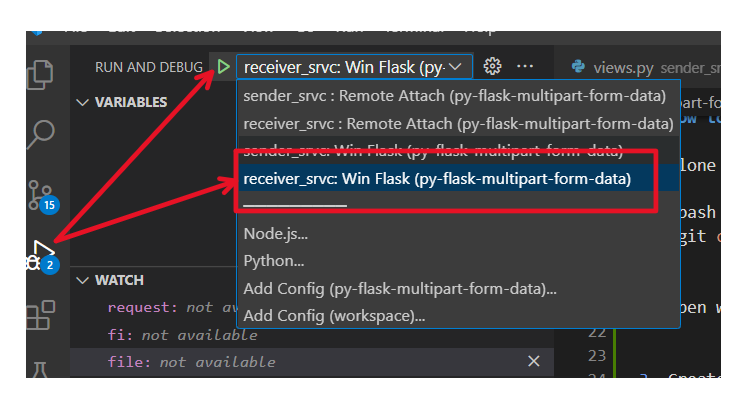
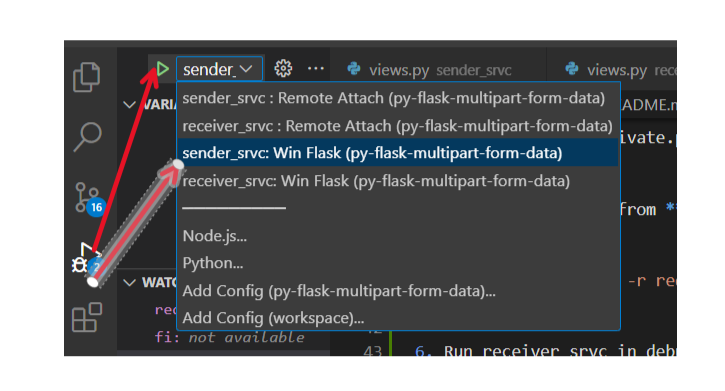
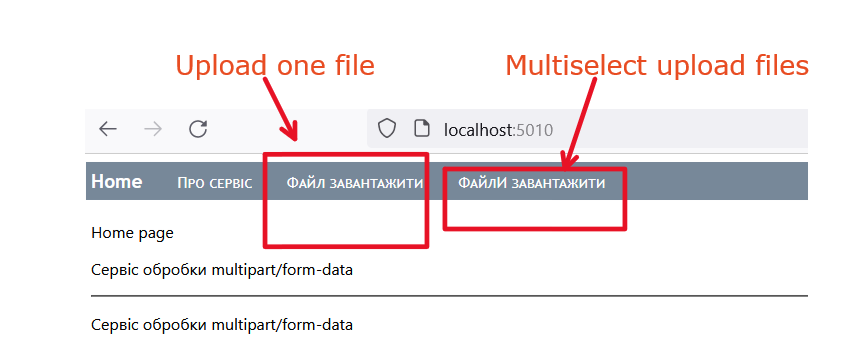
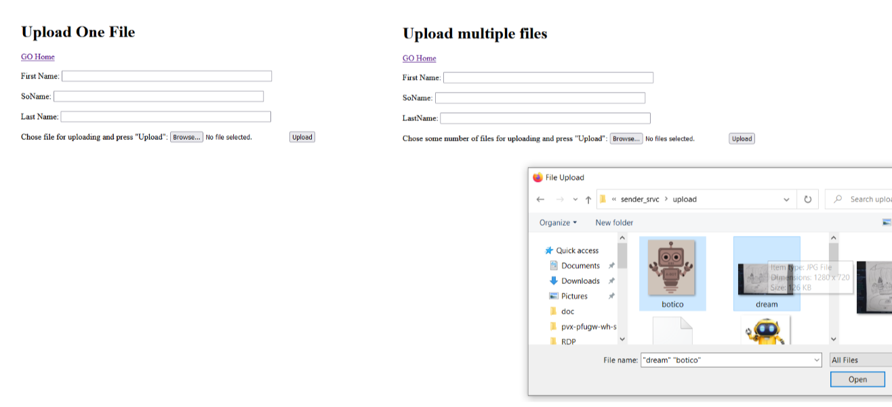

# py-flask-multipart-form-data
How to send and process multipart/form-data http requests

## The idea

The main idea is how to send and receive multipart/form-data using python flask because a lot of pieces of advice but they are partially.
There are two projects:
- **receiver_srcv** is the projects which receives and process multipart/form-data reqiests. In addition, this project has html-forms to upload on file or multiselected files;
- **sender_srcv** is the projects which constructs and sends a multipart/form-data reqiests.

Web requests ( from html page ) and programmatical requests (from **sender_srcv**) should be processed using the same routers using the similar approach.

## How to run locally

1. Clone the git repo. 
 
 ```bash
    git clone https://github.com/pavlo-shcherbukha/py-flask-multipart-form-data.git

```
2. Open workspace **py-lab.code-workspace** using Vsc.


3. Create virtual environment using command

```bash
    py -m venv env

```

4. Activate  virtual environment using command

```bash
    .\env\Scripts\activate.ps1  
```

5. Install dependies from **requirements.txt** using command

```bash
    py -m pip install -r requirements.txt
```

6. Run receiver_srvc in debug mode as is shown on <a href="#pic-1">pic-1</a>

<kbd></kbd>
<p style="text-align: center;"><a name="pic-1">pic-1</a></p>


7. Run sender_srvc in debug mode as is shown on <a href="#pic-2">pic-2</a>

<kbd></kbd>
<p style="text-align: center;"><a name="pic-2">pic-2</a></p>


8. Addition remarks

You can correct ports which every service listen to  in the file **.vscode/launch.json**
Change the port number under the key **"args"**, past  the key **"--port"**. By default, the sender_srvc listen to port 5000, receiver_srvc listen port 5010.  In case changing  port number do not forget to change env variable **DATA_URL** and **DATAMULTI_URL**.


```json
        {
            "name": "sender_srvc: Win Flask",
            "type": "python",
            "request": "launch",
            "module": "flask",
            "env": {
                "FLASK_APP": "sender_srvc.webapp",
                "FLASK_ENV": "development",
                "FLASK_DEBUG": "0",
                "DATA_URL": "http://localhost:5010/api/datareceiver",
                "DATAMULTI_URL": "http://localhost:5010/api/datareceivermulti",
                "FILE_STORE": "sender_srvc/upload"
            },
            "args": [
                "run",
                "--no-debugger",
                "--no-reload",
                "--port",
                "5000"
            ],
            "jinja": true
        },
        {
            "name": "receiver_srvc: Win Flask",
            "type": "python",
            "request": "launch",
            "module": "flask",
            "env": {
                "FLASK_APP": "receiver_srvc.webapp",
                "FLASK_ENV": "development",
                "FLASK_DEBUG": "0"
                        },
            "args": [
                "run",
                "--no-debugger",
                "--no-reload",
                "--port",
                "5010"
            ],
            "jinja": true
        }

```

## receiver_srvc - How to use

It contains small UI which provides possibility to upload files using html form. The main form is accessed by url http://localhost:5010/  and  is sown on <a href="#pic-3">pic-3</a>

<kbd></kbd>
<p style="text-align: center;"><a name="pic-3">pic-3</a></p>

Youc can select any type of uploading as is shown on <a href="#pic-4">pic-4</a>

<kbd></kbd>
<p style="text-align: center;"><a name="pic-4">pic-4</a></p>


One file uploads is processing by using api: 

HTTP-POST: http://localhost:5010/api/datareceiver 


it returns JSON RESPONSE which contains the file parameters and form fields, as an example:

```json

{
    "ok": true,
    "file_params": {
        "filename": "robot-2.jpg",
        "contentType": "image/jpeg",
        "mimetype": "image/jpeg",
        "stored": "receiver_srvc/uplfiles/robot-2.jpg"
    },
    "form_data_params": {
        "fname": "Sasdgf",
        "mname": "Tref",
        "lname": "RRRtTYYU"
    }
}

```


Multi file uploads is processing by using api: 

HTTP-POST: http://localhost:5010/api/datareceivermulti 

it returns JSON RESPONSE withc contains the  array if uploaded files with their parameters and form fields, as an example:

```json
{
    "ok": true,
    "file_params": [
        {
            "filename": "robot-1.jpg",
            "contentType": "image/jpeg",
            "mimetype": "image/jpeg",
            "stored": "receiver_srvc/uplfiles/robot-1.jpg"
        },
        {
            "filename": "robot-2.jpg",
            "contentType": "image/jpeg",
            "mimetype": "image/jpeg",
            "stored": "receiver_srvc/uplfiles/robot-2.jpg"
        }
    ],
    "form_data_params": {
        "fname": "Petrenko",
        "mname": "Semen",
        "lname": "Semen"
    }
}

```

All uploaded files are stored in subfolder **receiver_srvc/uplfiles**.
## sender_srvc - How to use


It contains small UI which  is using ony for checking and starts on  url http://localhost:5000/
It contains the api which builds and sends "multipart/form-data" requests with form data and  file attachments.


###  HTTP-GET:  http://localhost:5000/api/url3senddata

Send a single fake file as attachment and some form data using url3 lib. A fake file is let say byte array from  blob of database. The request is processed using http://localhost:5010/api/datareceiver 

###  HTTP-GET:  http://localhost:5000/api/url3sendfile

Send a single real file as attachment and some form data using url3 lib. The request is processed using http://localhost:5010/api/datareceiver 


###  HTTP-GET:  http://localhost:5000/api/url3sendfilemulti

Send a number of real files as attachments and some form data using url3 lib. The request is processed using http://localhost:5010/api/datareceivermulti  

###  HTTP-GET:  http://localhost:5000/api/pysenddata

Send multipart/form data using  python requests and requests_toolbelt.multipart.encoder. Send fake file as attachment  and form data using python requests module. The request is processed using http://localhost:5010/api/datareceiver.

###  HTTP-GET:  http://localhost:5000/api/pysendfile

Send multipart/form data using  python requests and requests_toolbelt.multipart.encoder.  Send real single file as attachment  and form data using python requests module. The request is processed using http://localhost:5010/api/datareceiver.

###  HTTP-GET:  http://localhost:5000/api/pysendfilemulti

Send multipart/form data using  python requests and requests_toolbelt.multipart.encoder.  Send real multi files as attachments  and form data using python requests module. The request is processed using http://localhost:5010/api/datareceivermulti.


Files are taken from folder sender_srvc/upload  for uploading

## Useful documnets


-  How to use Flask request та werkzeug
[werkzeug.FileStorage.save](https://tedboy.github.io/flask/generated/generated/werkzeug.FileStorage.save.html#werkzeug.FileStorage.save)

- werkzeug.ImmutableMultiDict

[werkzeug.ImmutableMultiDict how to parse ](https://tedboy.github.io/flask/generated/generated/werkzeug.ImmutableMultiDict.html)

- Flask patterns, file uploads
[Flask patterns, file uploads](https://tedboy.github.io/flask/patterns/fileuploads.html)

- url3 lib

[urllib3 user-guide](https://urllib3.readthedocs.io/en/stable/user-guide.html)

- requests-toolbelt lib

[requests-toolbelt on pypi](https://pypi.org/project/requests-toolbelt/)
[requests-toolbelt on git hub ](https://github.com/requests/toolbelt)


